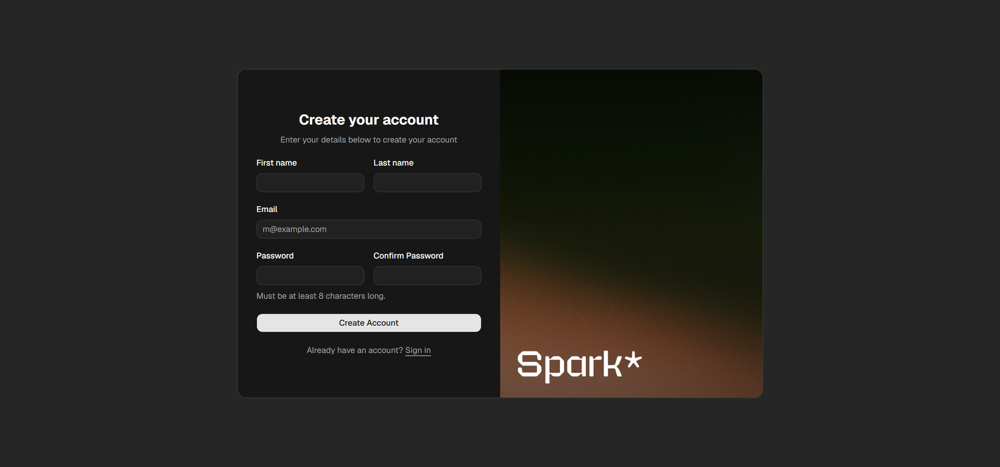
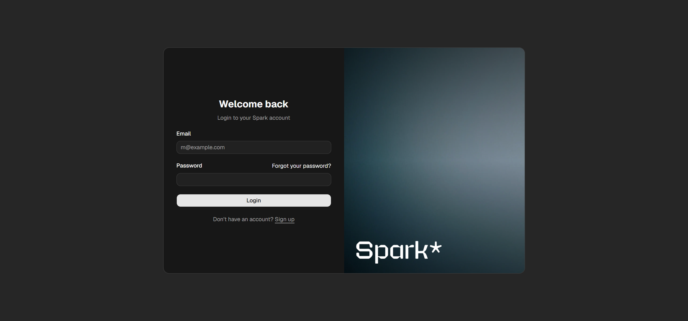
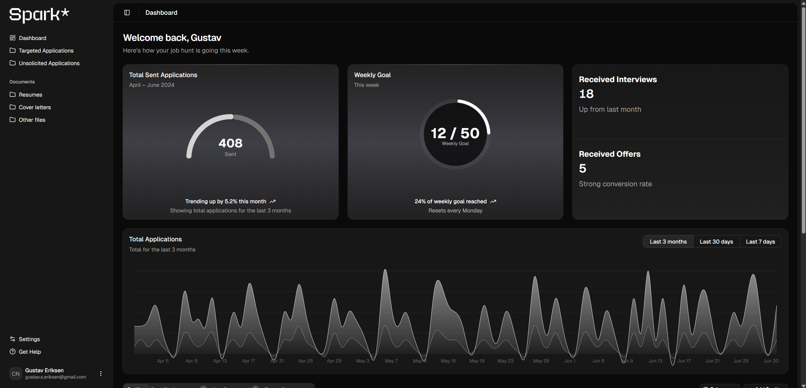

#  Spark | Full-Stack Job Application Tracker


> **Status:** Currently in active development (2026).

Spark is a full-stack platform designed to streamline the job search process. Instead of throwing applications into the void, Spark utilizes a Custom Value-Matching Algorithm to score job compatibility based on personal preferences like salary, commute time, and remote flexibility.

##  Visual Preview

### Sign Up


### Sign In


### Dashboard



##  Key Features

* **Value-Matching Engine:** A custom Java algorithm that weighs user preferences (commute, salary, tech stack) against job descriptions to generate a personalized Match Score (%).
* **Decoupled Architecture:** Built as a scalable Monorepo separating the robust Spring Boot REST API from the React frontend.

##  Architecture & Tech Stack

This project is structured as a Monorepo containing two decoupled applications:

* **Frontend (`/spark-web`):** Next.js (App Router), React, TypeScript, Tailwind CSS, shadcn/ui.
* **Backend (`/spark-api`):** Java 25, Spring Boot 3, Spring Data JPA, Spring Security.
* **Database:** PostgreSQL.
* **Documentation:** View the full [Architecture Decision Records (ADR)](./docs/05-architecture-decisions.md) for deeper technical insights.

##  Local Development Setup

To run this application locally, you will need Java 25, Node.js, and a running PostgreSQL instance.

**1. Clone the repository:**
```bash
git clone [https://github.com/Gustavseriksen/Spark.git](https://github.com/Gustavseriksen/Spark.git)
cd Spark