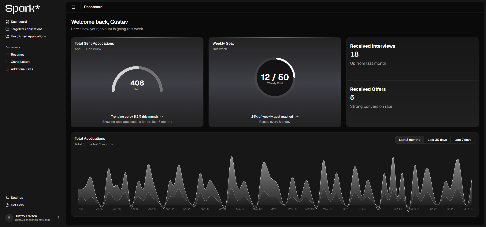
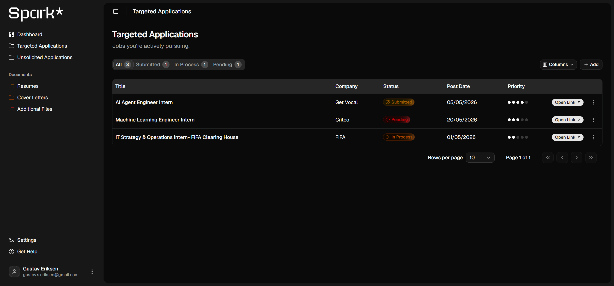
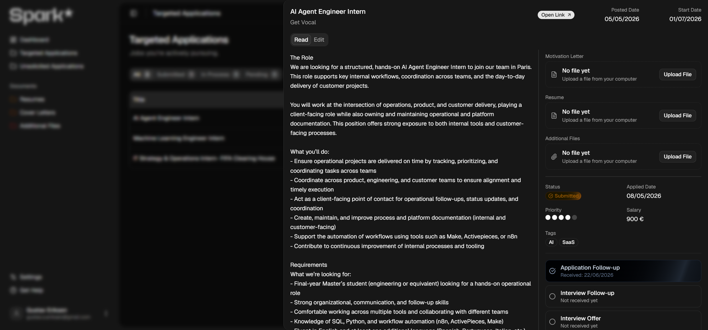
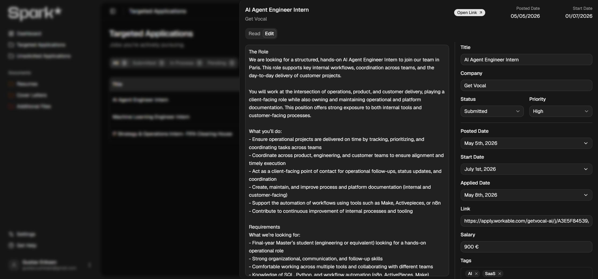
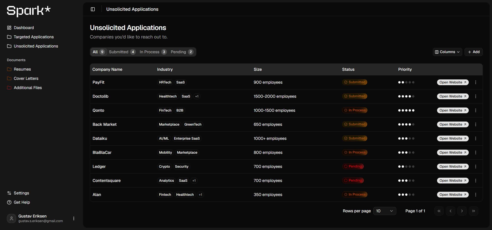
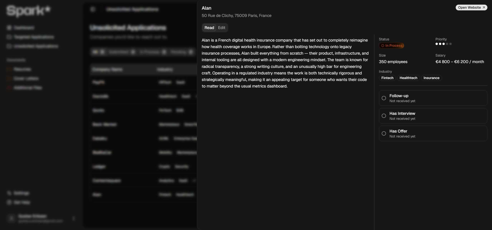
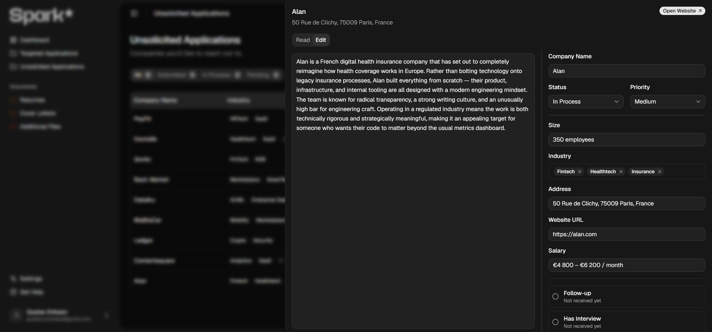
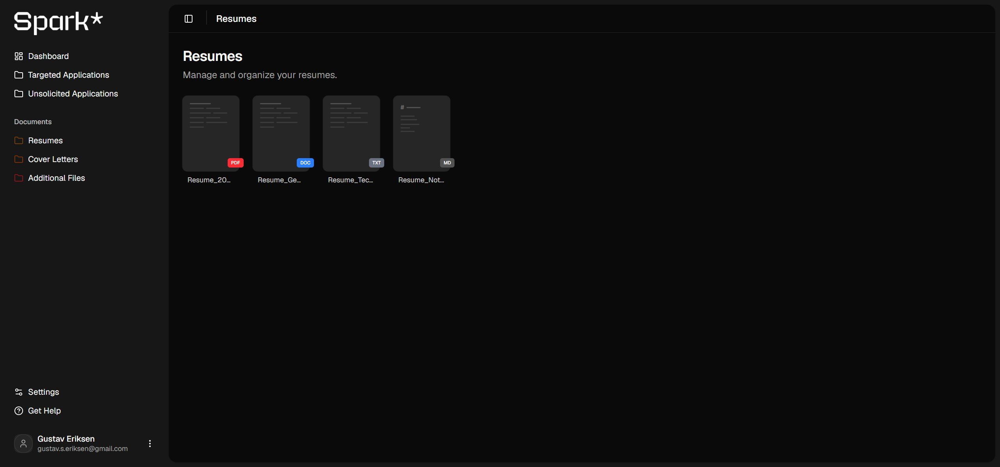
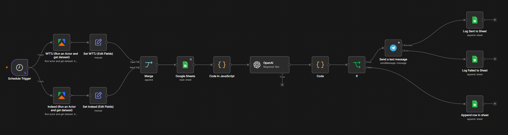

# Spark | Full-Stack Job Application Tracker


> **Status:** In active development (2026).

Spark is a full-stack platform designed to take the chaos out of the job search. Instead of juggling spreadsheets and browser tabs, you track every application, from targeted job ads to cold-contact companies, in one place, with statuses, priorities, follow-ups, and interview/offer milestones at a glance.

## Visual Preview

### Dashboard
Your job hunt at a glance: total applications sent, weekly goal progress, interviews and offers received, and application activity over time.



### Targeted Applications
Track specific job postings with status, priority, and quick access to the original ad.



Every application opens in a slide-out panel with the full job description, tags, salary, and a timeline of follow-ups, interviews, and offers, plus an edit mode for quick updates.

| Read | Edit |
|:---:|:---:|
|  |  |

### Unsolicited Applications
Manage the companies you want to cold-contact, with industry tags, size, and follow-up tracking, in the same table-plus-drawer workflow.



| Read | Edit |
|:---:|:---:|
|  |  |

### Document Hub
Keep resumes, cover letters, and additional files organized and ready to attach.



### Sign Up / Sign In
| | |
|:---:|:---:|
|  |  |

## Features

* **Targeted applications:** full CRUD for job ads, including post/start/applied dates, tags, salary, priority, and interview/offer tracking.
* **Unsolicited applications:** manage companies you want to cold-contact, with industry tags, size, follow-up dates, and status.
* **Slide-out detail panels:** read and edit any application without leaving the table; delete with confirmation.
* **Smart tables:** status tabs with live counts, sorting, pagination, and column visibility built on TanStack Table.
* **Secure authentication:** JWT access + refresh tokens delivered as httpOnly cookies, backed by Spring Security.
* **Document hub:** dedicated pages for resumes, cover letters, and additional files.

## Roadmap

* **Value-Matching Engine:** a weighted scoring algorithm that rates each job against your personal preferences (salary, commute, tech stack) and produces a Match Score (%).
* **Company data enrichment:** pull company profiles (description, website, industry tags, headcount, address) from an enrichment API such as Hunter.io, so adding a company takes one search instead of manual typing.
* **Job ad capture (browser extension):** save a job posting straight from the page you're reading, with title, description, and details extracted automatically.
* **Application auto-fill (browser extension):** fill out recurring application form fields automatically from your saved profile and documents.
* **File uploads:** attach motivation letters, resumes, and supporting files directly to applications.
* **Analytics & gamification:** application streaks, weekly goals, and interview conversion charts.
* **External integrations:** commute time via Google Maps, salary range estimation via LLM.
* **Automated job discovery:** integrate the existing scraper pipeline (see below) so newly found jobs flow directly into your targeted applications.

## Job Discovery Pipeline (working prototype)

Alongside the main application, I have built a working job discovery pipeline that will later be integrated into Spark:



An [n8n](https://n8n.io) workflow that automatically finds, scores, and delivers relevant software engineering internships in Paris:

1. **Schedule Trigger:** runs every 2 hours.
2. **Scrape:** two [Apify](https://apify.com) actors run in parallel, pulling listings from **Welcome to the Jungle** and **Indeed**.
3. **Normalize & merge:** each source's fields are mapped to a common schema and merged into one stream.
4. **Deduplicate:** a Code node checks listings against the Google Sheet log (the same sheet written in step 7, doubling as the pipeline's memory) and drops anything already seen.
5. **AI scoring:** new listings are sent to OpenAI (gpt-4o-mini), which rates each from 1 to 5 for relevance to a junior software engineering internship, with a short reason.
6. **Filter:** an If node keeps only listings scoring 3 or higher.
7. **Notify & log:** matches are pushed to my phone via **Telegram** and recorded in Google Sheets with their delivery status; below-threshold jobs are logged as `not_sent`.

The planned integration will feed these discovered jobs directly into Spark's targeted applications, so new matches arrive pre-filled and ready to track.

## Architecture & Tech Stack

A decoupled monorepo with a pure REST API and a standalone web client:

```
Spark/
├── spark-web/   # Next.js 16 (App Router), React 19, TypeScript, Tailwind CSS 4, shadcn/ui
├── spark-api/   # Java 25, Spring Boot 4, Spring Data JPA, Spring Security, Maven
└── docs/        # Project docs: user stories, DB schema, API design, ADRs
```

* **Frontend** talks to the API over JSON with cookie-based auth (`credentials: include`).
* **Backend** follows standard enterprise layering: Controller → Service → Repository → Entity, with request/response DTOs and per-user ownership checks on every resource.
* **Database:** PostgreSQL, schema managed by Hibernate.

Deeper reading: [Architecture Decision Records](./docs/05-architecture-decisions.md) · [API Design](./docs/04-api-design.md) · [Database Schema](./docs/03-database-schema.md) · [User Stories](./docs/02-user-stories.md)

## Getting Started

### Prerequisites

* Java 25
* Node.js 20+
* PostgreSQL running locally on port `5432`

### 1. Clone the repository

```bash
git clone https://github.com/Gustavseriksen/Spark.git
cd Spark
```

### 2. Set up the database

Create the database the API connects to:

```sql
CREATE DATABASE spark_db;
```

Tables are created automatically by Hibernate on first startup.

### 3. Configure secrets

The API loads sensitive settings from a separate config file that is gitignored, so it is not included in the repository and you need to create it yourself. Create `spark-api/src/main/resources/application-secret.yaml` with the following content:

```yaml
spring:
  datasource:
    password: <your postgres password>

app:
  jwt:
    secret: <base64-encoded 256-bit secret>
    access-token-ttl-seconds: 900
    refresh-token-ttl-seconds: 604800
    cookie-secure: false
    cookie-same-site: Lax
```

Replace the two `<placeholders>` with your own values (without the angle brackets):

* `password`: the password of your local PostgreSQL user.
* `secret`: a random key used to sign JWTs. Generate one with:

  ```bash
  openssl rand -base64 32
  ```

  and paste the output. Any base64 string of 32 random bytes works.

The remaining values are sensible defaults for local development and can be kept as-is.

### 4. Run the backend

```bash
cd spark-api
./mvnw spring-boot:run     # Windows: .\mvnw.cmd spring-boot:run
```

The API starts on [http://localhost:8080](http://localhost:8080).

### 5. Run the frontend

```bash
cd spark-web
npm install
npm run dev
```

Open [http://localhost:3000](http://localhost:3000), create an account, and start tracking.
